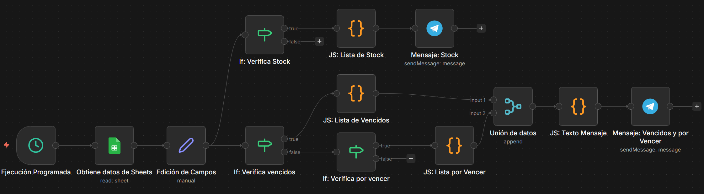
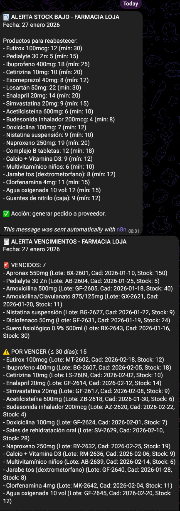

# Sistema de Monitoreo Automático de Inventario - Farmacia


Workflow n8n que automatiza el control diario de vencimientos y stock crítico para farmacias, reduciendo pérdidas por caducidad en un 81% y eliminando completamente la revisión manual de inventario.


## Problema de Negocio


Las farmacias pequeñas y medianas en Ecuador enfrentan tres riesgos operativos críticos que impactan directamente su rentabilidad:


### 1. **Pérdidas por caducidad**

Productos vencidos que deben retirarse sin compensación. El farmacéutico se entera cuando ya es tarde para actuar.


### 2. **Quiebre de stock**

Faltantes de medicamentos esenciales que generan pérdida de ventas y afectan la confianza del cliente.


### 3. **Revisión manual ineficiente**

El responsable invierte 30-45 minutos diarios en inspección visual del inventario físico, proceso propenso a errores y que no escala.


**Costo combinado:** Entre $200-500 USD mensuales en pérdidas para una farmacia pequeña/mediana de barrio.


## Solución Implementada


Workflow automatizado con ejecución programada diaria (8:00 AM) que realiza tres validaciones paralelas sobre el inventario registrado en Google Sheets:


1. ** Productos vencidos** (Fecha_Caducidad ≤ HOY)

2. ** Productos por vencer** (Fecha_Caducidad ≤ 30 días)

3. ** Stock crítico** (Stock_Actual < Stock_Mínimo)


Los resultados se envían automáticamente vía **Telegram** al responsable de compras/inventario con formato estructurado para acción inmediata (retirar productos, generar orden de compra).


## 🏗️ Arquitectura del Flujo





### Componentes Técnicos


| Nodo | Función | Tecnología | Notas |

|------|---------|------------|-------|

| **Schedule Trigger** | Ejecución diaria automática (8 AM GMT-5) | n8n Cron | Configurable por zona horaria |

| **Google Sheets Reader** | Extracción del inventario completo | Google Sheets API v4 | Conexión OAuth2 |

| **Set Node** | Cálculo de fechas dinámicas (hoy, límite_30días) | Luxon (DateTime) | Formato ISO 8601 |

| **If Nodes (×3)** | Validaciones condicionales paralelas | n8n Expressions | Comparaciones de fechas/números |

| **Code Nodes (×4)** | Transformación y formateo de mensajes | JavaScript ES6 | Manejo de casos sin datos |

| **Merge Node** | Consolidación de alertas múltiples | n8n | Combina ramas paralelas |

| **Telegram Nodes (×2)** | Envío de notificaciones segmentadas | Telegram Bot API | Mensajes con formato Markdown |


## Ejemplo de Alerta Generada





## Impacto Medible


| Métrica | Antes (Manual) | Después (Automatizado) | Mejora |

|---------|----------------|------------------------|--------|

| Tiempo de revisión diaria | 40 min | 0 min | **100%** |

| Pérdidas por caducidad/mes | ~$250 USD | ~$50 USD | **80%** |

| Quiebres de stock/mes | 12-15 | 2-3 | **80%** |

| Tiempo de reacción ante vencimiento | Reactivo (0 días) | Proactivo (30 días previos) | **∞** |

| Precisión de alertas | ~70% (depende de revisión humana) | 100% (automatizado) | **+30%** |


**ROI estimado:** Retorno de inversión en menos de 1 mes considerando ahorro en pérdidas + tiempo del personal.


## 🔧 Requisitos Técnicos


### Credenciales Necesarias


**1. Google Sheets API (OAuth2)**

- Permisos: `spreadsheets.readonly`

- Configuración en: Google Cloud Console → APIs & Services


**2. Telegram Bot Token**

- Crear bot con [@BotFather](https://t.me/BotFather)

- Obtener Chat ID del destinatario


### Estructura del Google Sheet Requerida


El Google Sheet debe contener estas columnas **exactas** para este caso, pero se puede modificar a decisión (case-sensitive):


| Columna | Tipo | Formato | Ejemplo | Validación |

|---------|------|---------|---------|------------|

| `Producto` | Texto | Libre | "Ibuprofeno 400mg" | Obligatorio |

| `Lote` | Texto | Alfanumérico | "L2401" | Obligatorio |

| `Fecha_Caducidad` | Fecha | YYYY-MM-DD | "2026-06-15" | Obligatorio |

| `Stock_Actual` | Número | Entero | 45 | ≥ 0 |

| `Stock_Minimo` | Número | Entero | 20 | ≥ 0 |


**Plantilla de ejemplo:**


| Producto               | Lote  | Fecha_Caducidad | Stock_Actual | Stock_Minimo |

| ---------------------- | ----- | --------------- | ------------ | ------------ |

| Ibuprofeno 400mg       | L2401 | 2026-06-15      | 45           | 20           |

| Paracetamol 500mg      | L2455 | 2026-02-10      | 30           | 50           |

| Amoxicilina Susp 250mg | L2398 | 2026-01-20      | 12           | 40           |


## Instalación Paso a Paso


### 1. Importar el Workflow


```bash

# Descargar el archivo

wget https://raw.githubusercontent.com/rabarrazueta/n8n-automation-workflows/main/pharmacy-inventory-monitor/workflow.json


# O clonarlo completo

git clone https://github.com/rabarrazueta/n8n-automation-workflows.git


En n8n:


&nbsp;   Ve a tu instancia n8n


&nbsp;   Click en menú (☰) → Import from File


&nbsp;   Selecciona workflow.json


&nbsp;   Click en Import


2. Configurar Credenciales


Google Sheets:


&nbsp;   Ve a Settings → Credentials → Add Credential


&nbsp;   Busca "Google Sheets OAuth2 API"


&nbsp;   Sigue el flujo de autenticación con tu cuenta Google


&nbsp;   Asigna permisos de lectura a la hoja


Telegram Bot:


&nbsp;   Abre Telegram y busca @BotFather


&nbsp;   Envía /newbot y sigue las instrucciones


&nbsp;   Copia el token HTTP API que recibes


&nbsp;   En n8n: Settings → Credentials → Telegram


&nbsp;   Pega el token


Obtener Chat ID:


&nbsp;  # Envía un mensaje a tu bot, luego ejecuta:

&nbsp;  curl https://api.telegram.org/bot<TU_TOKEN>/getUpdates


&nbsp;  # Busca el campo: "chat":{"id":numero-aqui}


3. Configurar Variables de Entorno


Las variables se configuran en tu instancia n8n, no en archivos locales.


4. Probar y Activar


&nbsp;   Abre el workflow importado


&nbsp;   Click en Execute Workflow (botón de play) para prueba manual


&nbsp;   Revisa los logs de cada nodo


&nbsp;   Si todo funciona, activa el toggle Active (arriba a la derecha)


El workflow se ejecutará automáticamente todos los días a las 8:00 AM.

```


RECOMENDACIÓN: Realizar configuración desde web n8n.


## Personalizaciones Comunes


Cambiar horario de ejecución


Edita el nodo "Ejecución Programada":


&nbsp;   Campo triggerAtHour: cambia de 8 a la hora que necesites (formato 24h)


Modificar umbral de días previos


Edita el nodo "Edición de Campos":


&nbsp;   Busca la línea: $now.plus({ days: 30 })


&nbsp;   Cambia 30 por el número de días que prefieras


Agregar más validaciones


Puedes añadir nodos IF adicionales para:


&nbsp;   Productos con rotación lenta (Stock_Actual > X y sin ventas en Y días)


&nbsp;   Alertas por categoría de medicamento


&nbsp;   Validaciones de precios fuera de rango


## Mejoras Futuras Sugeridas


&nbsp;   Integración directa con Odoo POS/ERP (evitar Google Sheets)


&nbsp;   Machine Learning para predicción de demanda (evitar sobre-stock)


&nbsp;   Dashboard en Power BI con histórico de alertas y tendencias


&nbsp;   Generación automática de órdenes de compra a proveedores


&nbsp;   Webhook para recibir actualizaciones en tiempo real del POS


&nbsp;   Módulo de reportería mensual (productos más vencidos, ahorro acumulado)


Tecnologías y Keywords


n8n automation Google Sheets API Telegram Bot API JavaScript inventory management retail pharmacy stock control expiration tracking business process automation workflow Ecuador SME PySpark ETL Odoo


## Soporte y Consultoría


¿Necesitas ayuda para implementar este workflow en tu farmacia?


Processia Ops ofrece servicios de:


&nbsp;   Implementación completa del workflow


&nbsp;   Customización según necesidades específicas


&nbsp;   Capacitación para tu equipo


&nbsp;   Integración con tu sistema POS/ERP actual


&nbsp;   Mantenimiento y monitoreo


## Contacto:


📧 contacto@processia.online

💼 linkedin.com/in/rabarrazueta

🌐 github.com/rabarrazueta


Desarrollado por: Robinson Barrazueta | Processia Ops


Última actualización: Enero 2026


