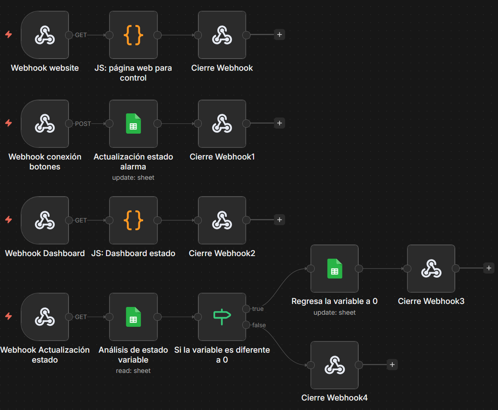
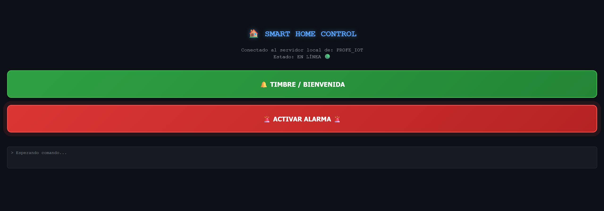

# IoT con n8n


Demostración práctica del uso de **n8n como servidor IoT**, reemplazando infraestructura tradicional (MQTT brokers, servidores dedicados) con workflows de automatización. Este proyecto muestra que n8n no es solo una herramienta de integración de apps, sino que puede actuar como backend completo para sistemas físicos conectados.


## Concepto


En un sistema IoT tradicional necesitas:

- Un broker MQTT (Mosquitto, HiveMQ)

- Un servidor backend (Node.js, Flask)

- Una base de datos para estado

- Un frontend para control


**Con n8n, todo eso se reemplaza con un solo workflow.**


Este proyecto usa Google Sheets como memoria de estado (simulando una base de datos ligera, solo por fines educativos) y webhooks HTTP como canal de comunicación, el mismo protocolo que usaría cualquier microcontrolador con conectividad Wi-Fi (ESP8266, ESP32, Arduino con shield ethernet, Raspberry Pi, etc.)


## Arquitectura del Flujo





El sistema tiene 4 canales de comunicación independientes, cada uno manejado por un webhook:


```

┌─────────────────────────────────────────────────────────┐

│                     n8n WORKFLOW                        │

│                                                         │

│  [GET /iot-website]  →  Sirve la UI de control al QR   │

│                                                         │

│  [POST /recibir-accion] → Recibe comando del botón     │

│                        → Escribe estado en Sheets      │

│                                                         │

│  [GET /panel-profesor]  → Sirve el dashboard de monit. │

│                                                         │

│  [GET /consultar-estado]→ Lee estado en Sheets         │

│                        → Retorna JSON al dashboard     │

│                        → Resetea variable a 0          │

└─────────────────────────────────────────────────────────┘

&nbsp;            ↑↓                        ↑↓

&nbsp;   Interfaz de Control          Dashboard Profe

&nbsp;   (Alumnos vía QR)             (Monitoreo en vivo)

```


**Google Sheets actúa como base de datos de estado:**

- Columna `ID`: identificador de la variable (`control`)

- Columna `Valor`: estado actual (`0` = silencio, `1` = alerta, `2` = bienvenida)


## Interfaces


### Interfaz de Control (Alumno)

Accesible vía QR code desde cualquier dispositivo móvil.





Dos botones de acción:

- 🔔 **TIMBRE / BIENVENIDA** → Escribe `2` en Google Sheets

- 🚨 **ACTIVAR ALARMA** → Escribe `1` en Google Sheets


### Dashboard de Monitoreo (Profesor)

Panel en tiempo real con actualización cada 3 segundos.


Estados visuales:

- 🟢 **SISTEMA SEGURO** → Valor `0` (sin eventos)

- 🔴 **INTRUSO DETECTADO** → Valor `1` (modo alerta con sonido, directamente reproducido desde internet)

- 🔔 **VISITANTE EN PUERTA** → Valor `2` (bienvenida con sonido, directamente reproducido desde internet)


## Aplicación con Hardware Real


Aunque esta demo funciona 100% desde el navegador, la arquitectura es directamente aplicable a hardware físico. Cualquier dispositivo con conectividad Wi-Fi puede reemplazar los botones web:


| Hardware | Cómo se integra |

|---|---|

| **ESP32 / ESP8266** | `HTTPClient` hace POST al webhook al detectar evento |

| **Arduino + Shield Wi-Fi** | Librería `WiFiClient` envía request HTTP |

| **Raspberry Pi** | Script Python con `requests` llama al webhook |

| **Sensor de movimiento (PIR)** | Al detectar movimiento → POST a `/recibir-accion` con `action: alerta` |

| **Cámara con visión artificial** | OpenCV detecta evento → POST al webhook |

| **Sensor de puerta/ventana** | Al abrirse → POST con `action: bienvenida` |


**Ejemplo de código para ESP32:**

```cpp

#include <WiFi.h>

#include <HTTPClient.h>


const char* webhookUrl = "https://your-n8n-domain.com/webhook/recibir-accion";


void triggerAlarm() {

&nbsp; HTTPClient http;

&nbsp; http.begin(webhookUrl);

&nbsp; http.addHeader("Content-Type", "application/json");

&nbsp; http.POST("{"action":"alerta","device":"esp32_sensor"}");

&nbsp; http.end();

}

```


## Requisitos


- **n8n** v2.4.6+ (self-hosted con dominio público o túnel)

- **Google Sheets** con cuenta de Google y OAuth configurado en n8n

- **Navegador moderno** (para las interfaces HTML)


> IMPORTANTE: El webhook debe ser accesible públicamente para que los dispositivos móviles puedan conectarse. Si usas n8n local, puedes usar [ngrok](https://ngrok.com) o [Cloudflare Tunnel](https://developers.cloudflare.com/cloudflare-one/connections/connect-networks/) como alternativa gratuita. Actualmente yo uso un PaaS de Digital Ocean, la cual recomiendo mucho


## Instalación


### 1. Preparar Google Sheets


Crea una hoja de cálculo nueva con esta estructura exacta:


| ID | Valor |

|---|---|

| control | 0 |


Copia el **ID de la hoja** desde la URL:

```

https://docs.google.com/spreadsheets/d/[ESTE_ES_EL_ID]/edit

```


### 2. Configurar credenciales en n8n


1. En n8n: **Credentials → New → Google Sheets OAuth2**

2. Seguir el flujo de autenticación con tu cuenta de Google

3. Guardar con el nombre: `Google Sheets account`


### 3. Importar el workflow


1. En n8n: **Workflows → Import from File**

2. Seleccionar `workflow.json`

3. En los 3 nodos de Google Sheets, seleccionar tu hoja usando el ID del paso 1

4. Activar el workflow con el toggle **Active**


### 4. Configurar variables


Renombra `.env.example` a `.env` y completa los valores:


Ver `.env.example` para referencia completa de variables.


### 5. Generar el QR


Con el workflow activo, obtén la URL del webhook `iot-website`:

```

https://your-n8n-domain.com/webhook/iot-website

```


Genera el QR con cualquier servicio online ([qr-code-generator.com](https://www.qr-code-generator.com)) y proyéctalo para que los alumnos escaneen.


## URLs del Sistema


Una vez activo, el sistema expone estas rutas:


| URL | Método | Descripción |

|---|---|---|

| `/webhook/iot-website` | GET | Sirve la interfaz de control (QR) |

| `/webhook/recibir-accion` | POST | Recibe comandos de botones/hardware |

| `/webhook/panel-profesor` | GET | Sirve el dashboard de monitoreo |

| `/webhook/consultar-estado` | GET | Retorna estado actual en JSON |


## Estructura del Proyecto


```

iot-con-n8n/

│

├── .env.example          ← Variables de configuración

├── README.md             ← Este archivo

├── workflow.json         ← Workflow de n8n listo para importar

│

├── workflow-diagram.png  ← Captura del flujo en n8n

├── control.png           ← Interfaz de control (alumnos)

└── dashboard.png         ← Dashboard de monitoreo (profesor)

```


## Por qué n8n como servidor IoT


| Característica | Servidor Tradicional | n8n |

|---|---|---|

| **Setup** | Instalar Node.js, Express, configurar rutas | Importar JSON |

| **Base de datos** | PostgreSQL, MongoDB, Redis | Google Sheets / cualquier nodo |

| **Frontend** | HTML separado, servidor estático | Nodo Code con HTML embebido |

| **Escalabilidad** | Código adicional | Agregar nodos al workflow |

| **Costo** | VPS + dependencias | n8n ya instalado |

| **Curva de aprendizaje** | Alta | Baja (visual) |


## 📄 Licencia


MIT


## Autor


Mgs. Robinson Barrazueta - Ingeniería de Datos y Automatización

**Processia Ops** - Automatización de procesos empresariales

Ecuador 🇪🇨 · [processia.online](https://processia.online)


